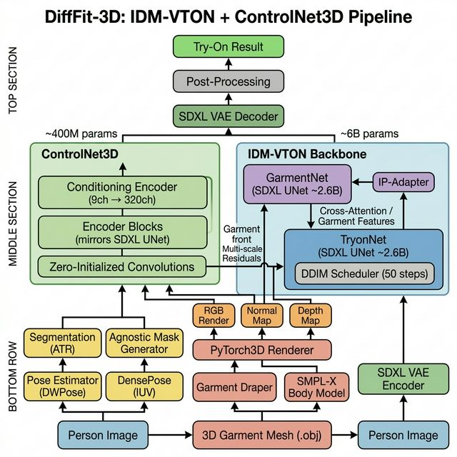
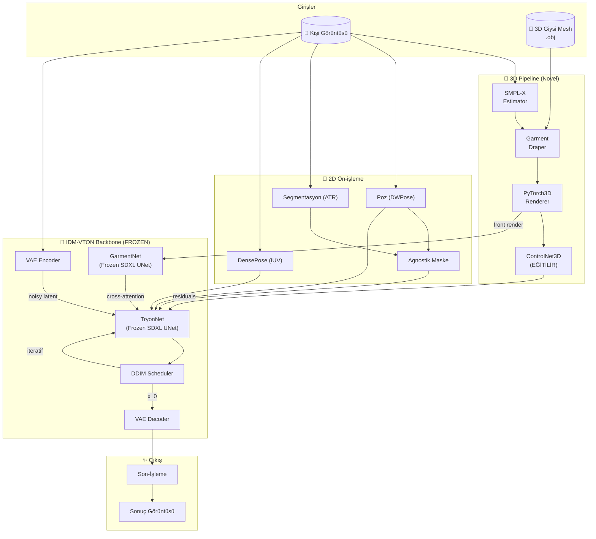
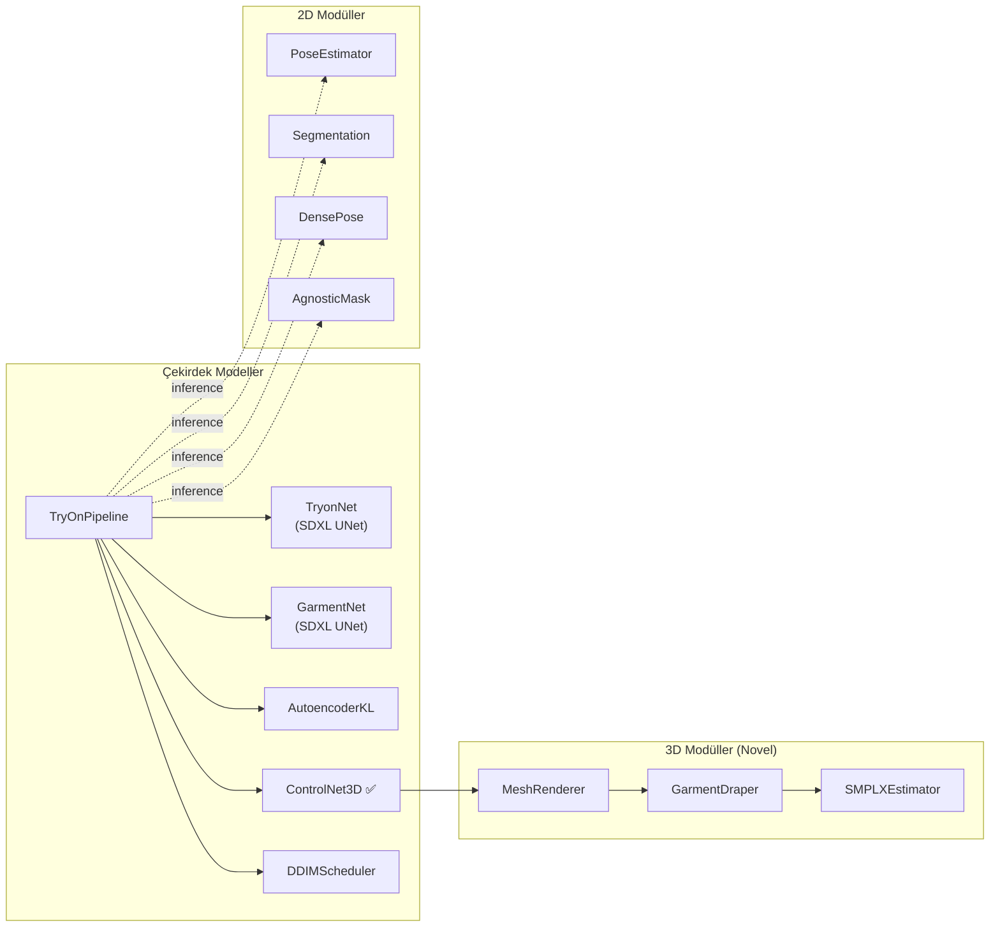

# DiffFit-3D: Mimari Açıklama (Architecture Deep Dive)

## Görsel Mimari Diyagramı



---

## 1. Genel Bakış (Overview)

DiffFit-3D, **IDM-VTON** (SDXL tabanlı) pre-trained backbone üzerine inşa edilmiş, **3D geometri farkındalığına** sahip bir sanal giysi deneme (virtual try-on) pipeline'ıdır. Mevcut 2D yöntemlerden farklı olarak, **gerçek 3D giysi mesh'lerini** kullanarak her açıdan (ön, yan, arka) geometrik olarak doğru sonuçlar üretir.

### Temel Felsefe

Mevcut 2D sanal giysi deneme yöntemleri şu sorunlarla karşı karşıyadır:
- **Ön yüz problemi**: Modeller yalnızca giysinin ön fotoğrafını öğrenir; kullanıcı arkasını döndüğünde bile giysinin ön yüzünü render eder
- **Perspektif tutarsızlıkları**: Yan/arka görünümlerde "sticker-like" yapışık görünüm
- **Vücut tipi çeşitliliği**: 2D warping farklı vücut tiplerine adapte olamaz

DiffFit-3D bu sorunları şu şekilde çözer:

1. **3D Giysi Mesh'leri**: `.obj` formatında 360° geometri ve doku bilgisi içeren gerçek 3D garment kullanımı
2. **SMPL-X Beden Tahmini**: Kişi fotoğrafından 3D beden parametreleri (β, θ) çıkarımı
3. **Differentiable 3D Rendering**: PyTorch3D ile her açıdan RGB render, normal map, depth map üretimi
4. **ControlNet3D**: 3D rendering çıktılarını IDM-VTON backbone'una enjekte eden yeni modül
5. **IDM-VTON Backbone**: SDXL tabanlı, önceden eğitilmiş dual-UNet mimarisi (frozen)

### Mimari Paradigma

```
Geleneksel 2D Try-On:   2D Garment Photo  →  Warp  →  Paste  →  Sonuç (sadece ön yüz)

DiffFit-3D:              3D Garment Mesh   →  SMPL-X Drape  →  PyTorch3D Render
                              ↓                                        ↓
                         GarmentNet (frozen)              ControlNet3D (eğitilir)
                              ↓                                        ↓
                              →→→→→  TryonNet (frozen)  ←←←←←←←←←←←←←←
                                           ↓
                                    VAE Decode → Sonuç (her açıdan)
```

---

## 2. Bileşen Mimarisi

### 2.1 Toplam Parametre Dağılımı

| Bileşen | Parametreler | Durum | Kaynak |
|---------|-------------|-------|--------|
| **TryonNet** (SDXL UNet) | ~2.6B | ❄️ Frozen | IDM-VTON (HuggingFace) |
| **GarmentNet** (SDXL UNet) | ~2.6B | ❄️ Frozen | IDM-VTON (HuggingFace) |
| **VAE** (SDXL AutoencoderKL) | ~85M | ❄️ Frozen | IDM-VTON (HuggingFace) |
| **CLIP Text Encoders** (×2) | ~800M | ❄️ Frozen | SDXL |
| **ControlNet3D** | ~350-400M | ✅ Eğitilir | **Yeni (Novel)** |
| **Toplam** | ~6.4B | — | ~%6 eğitilir |

---

## 3. 3D Pipeline — Novel Contribution

Bu bölüm DiffFit-3D'nin **özgün katkısıdır** ve mevcut hiçbir 2D try-on yönteminde bulunmaz.

### 3.1 SMPL-X Beden Tahmini

Kişi fotoğrafından 3D beden parametreleri çıkarılır:

```
Kişi Görüntüsü (B, 3, 512, 512)
        ↓
   SMPLXEstimator
        ↓
   Çıktılar:
     • betas (β):  (B, 10)   → Beden şekli parametreleri (boy, kilo, oranlar)
     • pose (θ):   (B, 63)   → Beden pozu (21 eklem × 3 axis-angle)
     • orient:     (B, 3)    → Global yönelim
     • transl:     (B, 3)    → Global pozisyon
     • vertices:   (B, 10475, 3) → 3D beden mesh vertex'leri
     • joints:     (B, 55, 3)    → 3D eklem konumları
```

**Mimari**: ResNet-50 backbone → Iterative regressor → SMPL-X body model

### 3.2 Garment Draper — Giysi Sargılama

3D giysi mesh'ini SMPL-X bedene fiziksel olarak uygun şekilde sargılar:

```
3D Giysi Mesh (.obj)     +     SMPL-X Beden Mesh
        ↓                              ↓
   ┌─────────────────────────────────────────┐
   │            Garment Draper               │
   │                                         │
   │  Phase 1: Kaba Hizalama                 │
   │    CorrespondenceNet(garment, body)      │
   │    → En yakın nokta eşleştirme          │
   │    → Affine dönüşüm                     │
   │                                         │
   │  Phase 2: İnce Deformasyon              │
   │    DeformMLP(coarse_verts, body_feats)   │
   │    → Malzeme-bilinçli deformasyon       │
   │    → Çarpışma tespiti + çözümü          │
   │                                         │
   │  Çıktı: draped_verts (B, V, 3)         │
   └─────────────────────────────────────────┘
```

**Çarpışma Yönetimi**: Giysi vertex'lerinin beden mesh'inin içine girmesini önleyen penalty fonksiyonu.

### 3.3 PyTorch3D Differentiable Renderer

Sargılanmış giysiyi istenen kamera açısından render eder:

```
Draped Garment Mesh  +  Kamera Parametreleri (azimuth, elevation, distance)
        ↓
   ┌────────────────────────────────────┐
   │        MeshRenderer (PyTorch3D)     │
   │                                     │
   │  Kamera: PerspectiveCameras         │
   │    • dist: 2.7  (kamera uzaklığı)   │
   │    • elev: 0    (yükseklik açısı)   │
   │    • azim: 0-360 (sürekli döndürme) │
   │                                     │
   │  Aydınlatma: PointLights            │
   │    • Phong shading modeli           │
   │    • Ambient + Diffuse + Specular   │
   │                                     │
   │  Çıktılar:                          │
   │    • RGB Render:  (B, 3, H, W)      │
   │    • Normal Map:  (B, 3, H, W)      │
   │    • Depth Map:   (B, 3, H, W)      │
   └────────────────────────────────────┘
```

**Kamera Açısı Örnekleri**:

| `azim` | Görünüm | Açıklama |
|--------|---------|----------|
| **0°** | Ön | Giysinin ön yüzü |
| **90°** | Yan | Giysinin sağ profili |
| **180°** | Arka | Giysinin arka yüzü — **2D yöntemlerin yapamadığı** |
| **270°** | Diğer yan | Giysinin sol profili |

---

## 4. ControlNet3D — 3D Koşullandırma Modülü (Novel)

3D rendering çıktılarını (RGB + normal + depth) IDM-VTON backbone'una çok ölçekli artık bağlantılar (residual connections) ile enjekte eden **yeni** modül.

### 4.1 Giriş Kodlayıcı

```
3D Conditioning Input: (B, 9, H, W)
  ├── RGB Render:  (B, 3, H, W)  → PyTorch3D'den render edilmiş giysi
  ├── Normal Map:  (B, 3, H, W)  → Yüzey normal vektörleri
  └── Depth Map:   (B, 3, H, W)  → Derinlik bilgisi

        ↓ ControlNet3DConditioningEncoder
Conv2d(9→16, k=3) → SiLU
Conv2d(16→32, k=3) → SiLU
Conv2d(32→96, k=3, s=2) → SiLU    ← ½ boyut
Conv2d(96→96, k=3) → SiLU
Conv2d(96→256, k=3, s=2) → SiLU   ← ¼ boyut
Conv2d(256→256, k=3) → SiLU
Conv2d(256→320, k=3, s=2) → SiLU  ← ⅛ boyut
        ↓
    (B, 320, H/8, W/8)
```

### 4.2 Encoder Blokları (UNet Encoder Aynası)

```
Giriş seviyesi → ZeroConv(320) → residual_0
        ↓
Level 0 (320 kanal):
  ResBlock(320→320) → ZeroConv → residual_1
  ResBlock(320→320) → ZeroConv → residual_2
  Downsample(stride=2) → ZeroConv → residual_3
        ↓
Level 1 (640 kanal):
  ResBlock(320→640) → ZeroConv → residual_4
  ResBlock(640→640) → ZeroConv → residual_5
  Downsample(stride=2) → ZeroConv → residual_6
        ↓
Level 2 (1280 kanal):
  ResBlock(640→1280) → ZeroConv → residual_7
  ResBlock(1280→1280) → ZeroConv → residual_8
  Downsample(stride=2) → ZeroConv → residual_9
        ↓
Level 3 (1280 kanal):
  ResBlock(1280→1280) → ZeroConv → residual_10
  ResBlock(1280→1280) → ZeroConv → residual_11
        ↓
Mid Block:
  ResBlock(1280→1280) → ZeroConv → residual_mid
```

### 4.3 Zero-Initialization Stratejisi

Her `ZeroConv` katmanı **sıfır ağırlıklarla** başlatılır:

```python
nn.init.zeros_(conv.weight)  # Tüm ağırlıklar 0
nn.init.zeros_(conv.bias)    # Tüm bias'lar 0
```

**Neden Önemli?**
- Eğitimin başında tüm residual çıktılar = **sıfır**
- Pre-trained IDM-VTON modeli hiç bozulmaz (`h + 0 = h`)
- ControlNet3D kademeli olarak 3D bilgiyi öğrenir
- Bu strateji, büyük pre-trained modeller için **altın standarttır** (orijinal ControlNet paper'ından)

### 4.4 Residual Injection — TryonNet'e Enjeksiyon

```
TryonNet Encoder Level i:    h_i = TryonNet_block_i(h_{i-1})
ControlNet3D Level i:        r_i = ZeroConv_i(ControlNet3D_block_i(c_{i-1}))

Birleştirme:                 h_i = h_i + r_i   ← residual toplama

TryonNet Mid Block:          h_mid = TryonNet_mid(h_last)
ControlNet3D Mid:            r_mid = ZeroConv_mid(ControlNet3D_mid(c_last))

Birleştirme:                 h_mid = h_mid + r_mid
```

---

## 5. IDM-VTON Backbone (Frozen)

### 5.1 TryonNet — Ana Denoising Backbone

SDXL UNet mimarisi, `yisol/IDM-VTON` HuggingFace deposundan yüklenir:

```
Giriş: concat(noisy_latent, agnostic_latent) → (B, 8, 64, 64)

SDXL UNet Encoder:
  DownBlock 0: (320)  × 2 ResBlock + Transformer → skip_0
  DownBlock 1: (640)  × 2 ResBlock + Transformer → skip_1
  DownBlock 2: (1280) × 2 ResBlock + Transformer → skip_2
  DownBlock 3: (1280) × 2 ResBlock + Transformer → skip_3

Mid Block: (1280) ResBlock + Transformer + ResBlock

SDXL UNet Decoder:
  UpBlock 3: concat(h, skip_3) → (1280) × 3 ResBlock + Transformer
  UpBlock 2: concat(h, skip_2) → (1280) × 3 ResBlock + Transformer
  UpBlock 1: concat(h, skip_1) → (640)  × 3 ResBlock + Transformer
  UpBlock 0: concat(h, skip_0) → (320)  × 3 ResBlock + Transformer

Çıkış: Conv2d(320, 4) → ε̂ (tahmin edilen gürültü)
```

**ControlNet3D Injection noktaları**: Her encoder level'ın çıktısına ve mid block'a 3D residual'lar eklenir.

### 5.2 GarmentNet — Frozen Giysi Feature Extractor

IDM-VTON'un ikinci SDXL UNet'i, giysi görüntüsünden çok ölçekli özellik çıkarır:

```
Giysi Görüntüsü → VAE.encode → garment_latent (B, 4, 64, 64)
        ↓
GarmentNet (Frozen SDXL UNet)
        ↓
Multi-scale garment features
        ↓
IP-Adapter encoding → garment_embeddings  (B, N_tokens, 768)
        ↓
Cross-Attention ile TryonNet'e enjeksiyon
```

**Garment → Person Cross-Attention**:

```
Q = W_q · person_features      (TryonNet'ten gelen)
K = W_k · garment_embeddings   (GarmentNet'ten gelen)
V = W_v · garment_embeddings

CrossAttn(Q, K, V) = softmax(Q·K^T / √d_k) · V
```

### 5.3 VAE — Latent Uzay Dönüşümü (SDXL)

SDXL AutoencoderKL, SD 1.5'ten farklı ölçekleme faktörü kullanır:

```
Encoder: Görüntü (3, 512, 512) → Latent (4, 64, 64)
Decoder: Latent (4, 64, 64) → Görüntü (3, 512, 512)
Ölçekleme Faktörü: 0.13025  (SD 1.5: 0.18215)
```

Kanal progresyonu: `128 → 256 → 512 → 512`

> **Önemli**: VAE, TryonNet ve GarmentNet ağırlıkları eğitim sırasında tamamen **dondurulur** (frozen). Yalnızca ControlNet3D eğitilir.

---

## 6. 2D Koşullandırma Sinyalleri

3D pipeline'ın yanı sıra, standart 2D koşullandırma sinyalleri de kullanılır:

### 6.1 Kişi Ön-İşleme

```
Kişi Görüntüsü (B, 3, 512, 512)
        ↓
   ┌─────────────────────────┐
   │ Poz Tahmini (DWPose)    │ → 18 keypoint (COCO-18)
   │ Segmentasyon (ATR-18)   │ → 18 sınıf vücut parçaları
   │ DensePose (IUV)         │ → 24 bölge yüzey UV haritası
   │ Agnostik Maske          │ → Giysi bölgesi maskelenmiş
   └─────────────────────────┘
```

### 6.2 Koşullandırma Tensörleri

| Sinyal | Boyut | Açıklama |
|--------|-------|----------|
| Agnostik Maske | `(B, 3, 512, 512)` | Giysi bölgesi maskelenmiş kişi |
| Poz Haritası | `(B, 3, 512, 512)` | İskelet render'ı (RGB) |
| DensePose IUV | `(B, 3, 512, 512)` | I(parça indeksi)/U/V yüzey koordinatları |
| **3D Conditioning** | `(B, 9, 512, 512)` | RGB render + Normal map + Depth map |

---

## 7. Gürültü Zamanlayıcı (Noise Scheduler)

### 7.1 İleri Süreç — Gürültü Ekleme

```
q(x_t | x_0) = N(x_t; √(ᾱ_t) · x_0, (1 - ᾱ_t) · I)

x_t = √(ᾱ_t) · x_0 + √(1 - ᾱ_t) · ε,   ε ~ N(0, I)
```

### 7.2 Beta Zamanlama Şemaları

| Şema | Formül | Kullanım |
|------|--------|----------|
| **Ölçeklenmiş Lineer** | `β_t = (√β_start + t·(√β_end - √β_start)/T)²` | Varsayılan (SDXL) |
| **Kosinüs** | `ᾱ_t = cos²(π/2 · (t/T + s)/(1+s))` | En pürüzsüz geçiş |

### 7.3 DDIM — Hızlı Çıkarım

DDIM, 1000 adımlık eğitimi **50 adıma** sıkıştırarak hızlı çıkarım sağlar:

```
x_{t-1} = √(ᾱ_{t-1}) · x̂_0 + √(1 - ᾱ_{t-1} - σ²) · ε̂ + σ · ε

x̂_0 = (x_t - √(1-ᾱ_t) · ε̂) / √(ᾱ_t)
```

`η = 0` durumunda tamamen deterministik (tekrarlanabilir sonuçlar).

---

## 8. Eğitim Süreci

### 8.1 İleri Geçiş (Forward Pass)

```
 1. x_0 = VAE.encode(person_image)           → (B, 4, 64, 64) person latent
 2. g   = VAE.encode(garment_image)           → (B, 4, 64, 64) garment latent
 3. ε ~ N(0, I)                               → rastgele gürültü
 4. t ~ U(0, 1000)                            → rastgele zaman adımı
 5. x_t = √(ᾱ_t)·x_0 + √(1-ᾱ_t)·ε          → gürültülü latent

 --- Koşullandırma (tümü frozen forward) ---
 6. garment_feats = GarmentNet(g, t)           → giysi feature'ları (frozen)
 7. cond_2d = concat(agnostic, pose, densepose)→ 2D koşullandırma

 --- 3D Pipeline (novel) ---
 8. smplx_params = SMPLXEstimator(person_img)  → 3D beden tahmini
 9. draped = GarmentDraper(mesh, smplx)        → sargılanmış giysi
10. rgb, normal, depth = MeshRenderer(draped)  → 3D render
11. cond_3d = concat(rgb, normal, depth)       → (B, 9, H, W)

 --- ControlNet3D (EĞİTİLİR) ---
12. residuals = ControlNet3D(cond_3d, t)       → çok ölçekli residual'lar

 --- Gürültü Tahmini ---
13. model_input = concat(x_t, agnostic_latent) → (B, 8, 64, 64)
14. ε̂ = TryonNet(model_input, t, garment_feats, residuals) → gürültü tahmini
15. loss = ||ε - ε̂||²                         → MSE kaybı
```

### 8.2 Kayıp Fonksiyonu

```
L_total = λ₁·L_MSE + λ₂·L_perceptual + λ₃·L_LPIPS + λ₄·L_adversarial + λ₅·L_KL
```

| Kayıp | Ağırlık | Açıklama |
|-------|---------|----------|
| **MSE** | 1.0 | `‖ε - ε̂‖²` — temel difüzyon kaybı |
| **VGG Perceptual** | 0.5 | VGG-19 çok katmanlı özellik karşılaştırma |
| **LPIPS** | 1.0 | AlexNet tabanlı algısal benzerlik |
| **Adversarial** | 0.1 | PatchGAN discriminator |
| **KL Divergence** | 0.0001 | VAE latent uzay düzenlileştirme |

### 8.3 Optimizasyon

```
Optimizer:           AdamW (β₁=0.9, β₂=0.999, weight_decay=0.01)
Öğrenme Hızı:        1e-5 (peak)
LR Scheduler:        Cosine Annealing + 500 adım Warmup
Mixed Precision:     FP16 (GradScaler ile)
Gradient Accumulation: 16 adım (effective batch = 16)
Max Gradient Norm:   1.0
Batch Size:          1 (T4 GPU — 15GB VRAM)
```

### 8.4 EMA (Exponential Moving Average)

```
θ_ema ← 0.9999 · θ_ema + 0.0001 · θ_model

update_after = 100 adım
update_every = 10 adım
```

> **Not**: EMA yalnızca ControlNet3D parametrelerine uygulanır (diğerleri frozen).

---

## 9. Çıkarım Süreci (Inference Pipeline)

### 9.1 Geleneksel 2D Modu

```
1. Ön-işleme: Kişi → poz, segmentasyon, DensePose, agnostik maske
2. Latent başlatma: x_T ~ N(0, I)
3. Giysi kodlama: garment_feats = GarmentNet(VAE.encode(garment), ·)
4. DDIM döngüsü (50 adım):
   for t in [T, T-1, ..., 1]:
     ε̂ = TryonNet(x_t, t, garment_feats)
     x_{t-1} = DDIM_step(x_t, ε̂, t)
5. Dekodlama: result = VAE.decode(x_0)
```

### 9.2 3D-Aware Modu (Novel)

```
1. Ön-işleme: Kişi → poz, segmentasyon, DensePose, agnostik maske
2. 3D Pipeline:
   a) SMPL-X beden tahmini
   b) 3D giysi mesh yükleme (.obj)
   c) Giysi sargılama (draping)
   d) Render: RGB + Normal + Depth (istenen açıdan)
3. Latent başlatma: x_T ~ N(0, I)
4. Giysi kodlama: garment_feats = GarmentNet(render_front, ·)
5. DDIM döngüsü (50 adım):
   for t in [T, T-1, ..., 1]:
     residuals = ControlNet3D(cond_3d, t)    ← 3D conditioning
     ε̂ = TryonNet(x_t, t, garment_feats, residuals)
     x_{t-1} = DDIM_step(x_t, ε̂, t)
6. Dekodlama: result = VAE.decode(x_0)
```

### 9.3 Multi-View Oluşturma

```bash
# Ön görünüm
python scripts/inference.py --person person.jpg --garment garment.obj --view_angle 0

# Yan görünüm
python scripts/inference.py --person person.jpg --garment garment.obj --view_angle 90

# Arka görünüm (2D yöntemlerin YAPAMADIĞI)
python scripts/inference.py --person person.jpg --garment garment.obj --view_angle 180
```

### 9.4 Classifier-Free Guidance

```
ε̂ = ε_unconditional + w · (ε_conditional - ε_unconditional)

w = 7.5 (varsayılan)
```

---

## 10. Veri Akış Diyagramı



---

## 11. Modül Bağımlılık Haritası



---

## 12. Hiperparametre Özeti

| Parametre | Değer | Açıklama |
|-----------|-------|----------|
| Çözünürlük | 512×512 | Giriş/çıkış görüntü boyutu |
| Latent boyut | 64×64×4 | SDXL VAE latent uzay |
| VAE ölçek faktörü | 0.13025 | SDXL VAE (SD 1.5: 0.18215) |
| UNet kanal çarpanları | [1, 2, 4, 4] | 320→640→1280→1280 |
| ControlNet3D giriş | 9 kanal | RGB(3) + Normal(3) + Depth(3) |
| Difüzyon adımları (eğitim) | 1000 | T |
| Difüzyon adımları (çıkarım) | 50 | DDIM |
| Rehberlik ölçeği | 7.5 | Classifier-free guidance |
| Batch boyutu | 1 (etkili: 16) | 16× gradyan birikimi |
| Öğrenme hızı | 1e-5 | AdamW (sadece ControlNet3D) |
| EMA bozunma | 0.9999 | Ağırlık ortalaması |
| Eğitilebilir parametreler | ~350-400M | Toplam'ın ~%6-7'si |

---

## 13. 2D Try-On Yöntemleri ile Karşılaştırma

| Özellik | 2D Yöntemler (IDM-VTON vanilla) | DiffFit-3D |
|---------|--------------------------------|------------|
| **Giysi girişi** | 2D fotoğraf (sadece ön yüz) | 3D mesh (360° geometri) |
| **Arka görünüm** | ❌ Ön yüzü yapıştırır / hallucinate | ✅ Mesh'in arkası render edilir |
| **Yan görünüm** | ❌ Bozuk sonuçlar | ✅ Her açıdan doğru render |
| **Vücut uyumu** | 2D warping (sınırlı) | 3D draping (fiziksel) |
| **Derinlik bilgisi** | ❌ Yok | ✅ Depth map conditioning |
| **Normal bilgisi** | ❌ Yok | ✅ Normal map conditioning |
| **Eğitim** | Tüm UNet (~2.6B param) | Sadece ControlNet3D (~400M) |
| **Pre-trained model** | Sıfırdan SDXL fine-tune | IDM-VTON frozen + ControlNet3D |

---

> **Sonuç**: DiffFit-3D, IDM-VTON'un önceden eğitilmiş SDXL backbone'unu (TryonNet + GarmentNet + VAE) **frozen** olarak kullanır ve üzerine **ControlNet3D** modülünü ekler. Bu modül, 3D giysi mesh'lerinden PyTorch3D ile render edilen RGB, normal map ve depth map bilgilerini çok ölçekli residual bağlantılarla TryonNet'e enjekte eder. Böylece, 2D yöntemlerin en büyük limitasyonu olan "ön yüz problemi" çözülür ve kullanıcı herhangi bir açıdan geometrik olarak doğru, fotorealistik try-on sonuçları elde eder.
