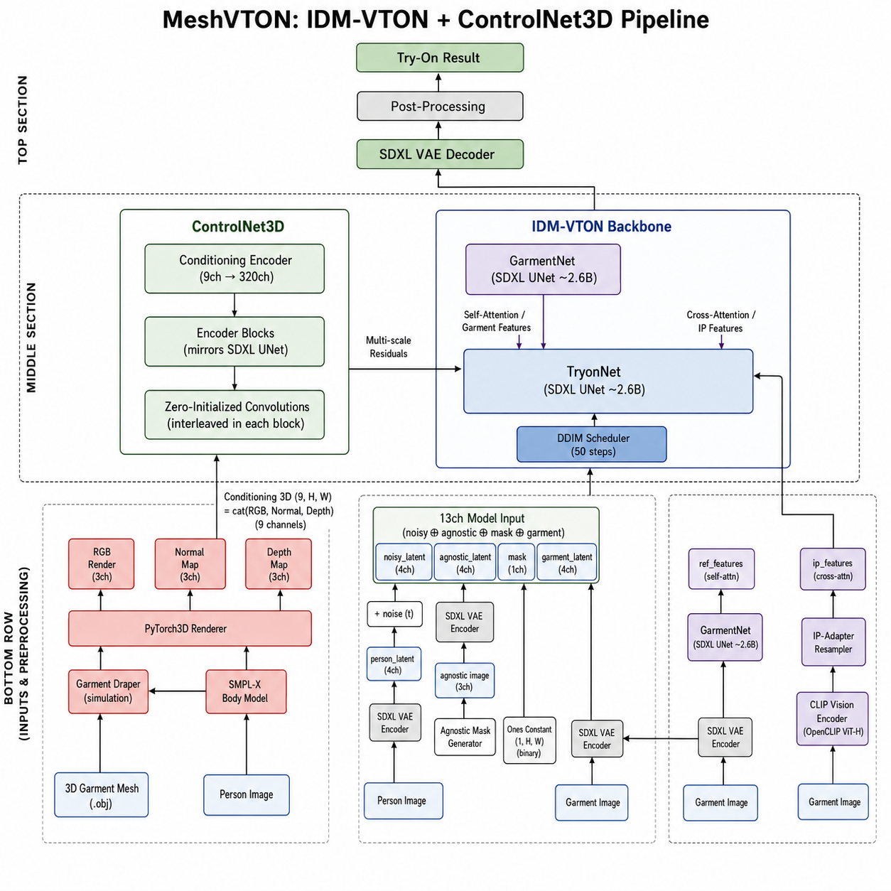
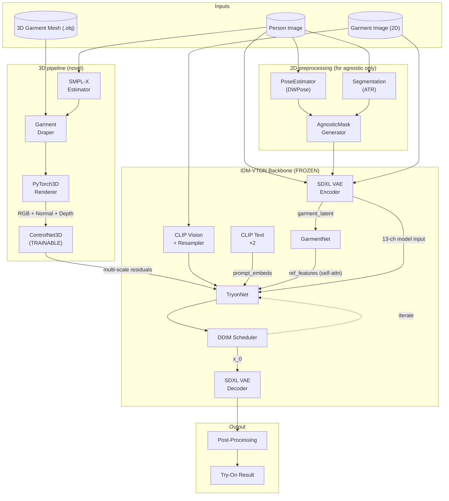
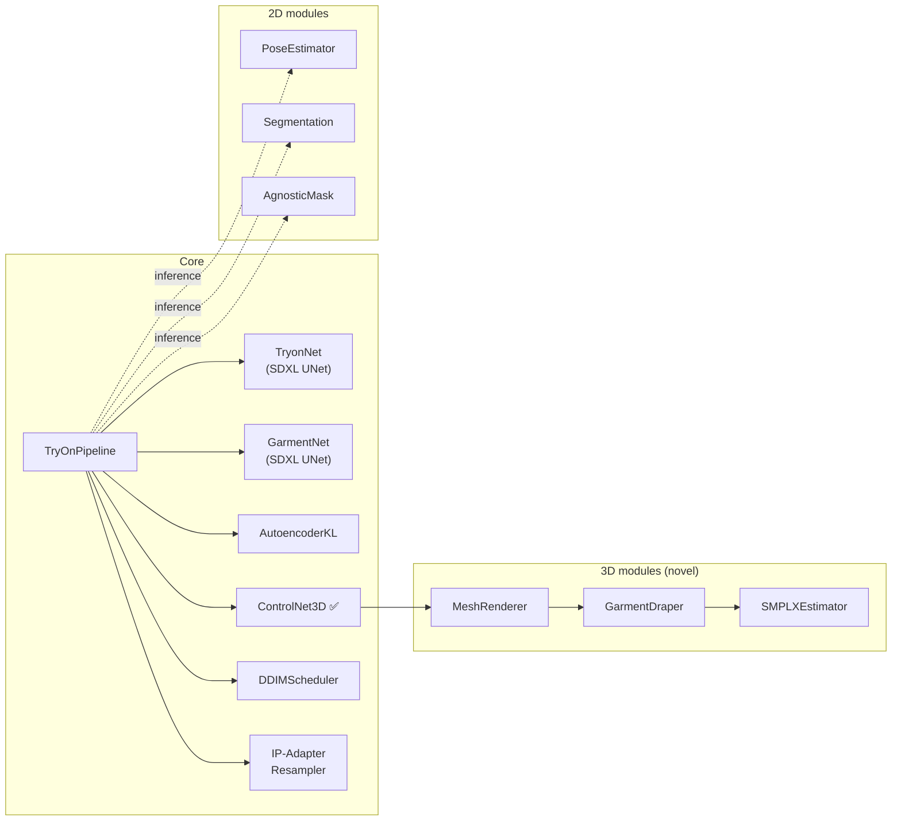

# MeshVTON: Architecture Deep Dive

## Visual Architecture Diagram



> The diagram is generated from code-truthful Python: `python docs/draw_architecture.py`. Every box and arrow corresponds to an actual call in the pipeline.

---

## 1. Overview

MeshVTON is a **geometry-aware** virtual try-on pipeline built on the pre-trained **IDM-VTON** (SDXL-based) backbone. Unlike 2D-only methods, it consumes **real 3D garment meshes** and produces geometrically consistent results from any camera angle (front, side, back).

### Core Idea

2D virtual try-on methods suffer from:
- **Front-only bias** — the network only ever sees frontal garment photos; turning the subject around still renders the garment's front
- **Perspective inconsistency** — side/back views look sticker-like
- **Body-shape brittleness** — 2D warping cannot generalize across body types

MeshVTON addresses these by:

1. **3D garment meshes** (`.obj`) — full 360° geometry instead of a single photo
2. **SMPL-X body estimation** — extracts 3D body parameters (β, θ) from the person photo
3. **Differentiable 3D rendering** (PyTorch3D) — produces RGB / normal / depth from any angle
4. **ControlNet3D** — novel module that injects 3D rendering outputs into the IDM-VTON backbone
5. **IDM-VTON backbone** — frozen, pre-trained dual-UNet (SDXL)

### Paradigm

```
Legacy 2D try-on:   2D garment photo  →  warp  →  paste  →  result (front only)

MeshVTON:           3D garment mesh   →  SMPL-X drape  →  PyTorch3D render
                           │                                         │
                      GarmentNet (frozen)                ControlNet3D (trainable)
                           │                                         │
                           └────►   TryonNet (frozen)   ◄────────────┘
                                          │
                                   VAE decode → result (any angle)
```

---

## 2. Component Architecture

### 2.1 Parameter Breakdown

| Component | Parameters | Status | Source |
|-----------|-----------:|--------|--------|
| **TryonNet** (SDXL UNet) | ~2.6B | ❄️ Frozen | IDM-VTON (HuggingFace) |
| **GarmentNet** (SDXL UNet) | ~2.6B | ❄️ Frozen | IDM-VTON (HuggingFace) |
| **VAE** (SDXL AutoencoderKL) | ~85M | ❄️ Frozen | IDM-VTON (HuggingFace) |
| **CLIP Vision Encoder** | ~1B | ❄️ Frozen | IDM-VTON (HuggingFace) |
| **CLIP Text Encoders** (×2) | ~800M | ❄️ Frozen | SDXL |
| **IP-Adapter Resampler** | ~50M | ❄️ Frozen | IDM-VTON |
| **ControlNet3D** | ~350–400M | ✅ **Trainable** | **Novel** |
| **Total** | ~7.5B | — | ~5–6 % trainable |

> All loaded from `yisol/IDM-VTON` via `from_pretrained()`. ControlNet3D is initialized from scratch.

---

## 3. 3D Pipeline — Novel Contribution

This is what makes MeshVTON different from every 2D try-on method.

### 3.1 SMPL-X Body Estimation

The person photo is regressed into SMPL-X parameters:

```
Person Image (B, 3, 512, 512)
        │
        ▼
   SMPLXEstimator
        │
        ▼
   Outputs:
     • betas (β):       (B, 10)         — body shape coefficients
     • body_pose (θ):   (B, 63)         — 21 joints × 3 axis-angle
     • global_orient:   (B, 3)          — global rotation
     • transl:          (B, 3)          — global translation
     • vertices:        (B, 10475, 3)   — 3D body mesh vertices
     • joints:          (B, 127, 3)     — 3D joint positions
     • faces:           (20908, 3)      — triangle topology
```

The implementation uses a simple ResNet-style regressor as a placeholder; in production it is meant to be swapped for PyMAF-X or ExPose.

### 3.2 Garment Draper

Wraps the 3D garment mesh onto the SMPL-X body:

```
3D Garment Mesh (.obj)     +     SMPL-X Body Mesh
        │                                │
        ▼                                ▼
   ┌─────────────────────────────────────────────┐
   │              GarmentDraper                  │
   │                                             │
   │   Stage 1: Coarse alignment                 │
   │     CorrespondenceNet(garment, body)        │
   │     → per-vertex offsets via MLP            │
   │                                             │
   │   Stage 2: Neural refinement                │
   │     stacked GarmentRefineBlocks             │
   │     → material-aware fine deformation       │
   │                                             │
   │   Output: { draped_verts, offsets, normals }│
   └─────────────────────────────────────────────┘
```

### 3.3 PyTorch3D Differentiable Renderer

Renders the draped garment from any camera angle:

```
Draped mesh + camera (azim, elev, dist)
        │
        ▼
   ┌────────────────────────────────────────┐
   │          MeshRenderer (PyTorch3D)      │
   │                                        │
   │   Cameras:  FoVPerspectiveCameras      │
   │     • dist = 2.7                       │
   │     • elev = 0                         │
   │     • azim ∈ [0, 360°]                 │
   │                                        │
   │   Lighting: PointLights                │
   │     Phong shading (ambient + diffuse   │
   │                    + specular)         │
   │                                        │
   │   Shader:   SoftPhongShader            │
   │                                        │
   │   Outputs:                             │
   │     • RGB Render:  (B, 3, H, W)        │
   │     • Normal Map:  (B, 3, H, W)        │
   │     • Depth Map:   (B, 1, H, W) → 3ch  │
   └────────────────────────────────────────┘
```

**Camera-angle examples:**

| `azim` | View | Note |
|--------|------|------|
| 0° | Front | Garment front |
| 90° | Side | Right profile |
| 180° | Back | **What 2D methods cannot do** |
| 270° | Side | Left profile |

The renderer is **differentiable** end-to-end — this matters when the upstream draping/SMPL-X parameters are also being optimized.

---

## 4. ControlNet3D — The Novel Module

ControlNet3D injects 3D rendering outputs (RGB + normal + depth) into the IDM-VTON TryonNet via multi-scale residual connections.

### 4.1 Conditioning Input

```
conditioning_3d : (B, 9, H, W)
  ├── RGB render   (B, 3, H, W)   ← PyTorch3D RGB
  ├── Normal map   (B, 3, H, W)   ← surface normals
  └── Depth map    (B, 3, H, W)   ← depth (broadcast 1→3 channels)
```

The dataset concatenates the three tensors into the 9-channel input ([dataset.py:104-118](../src/data/dataset.py#L104-L118)).

### 4.2 Conditioning Encoder

Down-samples the 9-channel input by 8× into the UNet's base channel width:

```
Input (B, 9, H, W)
  │
  ├─ Conv2d(9  → 16,  k=3)         + SiLU
  ├─ Conv2d(16 → 32,  k=3)         + SiLU
  ├─ Conv2d(32 → 96,  k=3, s=2)    + SiLU    ← ½
  ├─ Conv2d(96 → 96,  k=3)         + SiLU
  ├─ Conv2d(96 → 256, k=3, s=2)    + SiLU    ← ¼
  ├─ Conv2d(256→ 256, k=3)         + SiLU
  ├─ Conv2d(256→ 320, k=3, s=2)    + SiLU    ← ⅛
  ▼
(B, 320, H/8, W/8)
```

### 4.3 Encoder Blocks (mirror SDXL UNet)

```
Input level           → ZeroConv(320) → residual[0]

Level 0 (320 ch):
  ResBlock(320 → 320) → ZeroConv → residual[1]
  ResBlock(320 → 320) → ZeroConv → residual[2]
  Downsample (s=2)   → ZeroConv → residual[3]

Level 1 (640 ch):
  ResBlock(320 → 640) → ZeroConv → residual[4]
  ResBlock(640 → 640) → ZeroConv → residual[5]
  Downsample (s=2)   → ZeroConv → residual[6]

Level 2 (1280 ch):
  ResBlock(640 → 1280)  → ZeroConv → residual[7]
  ResBlock(1280→ 1280)  → ZeroConv → residual[8]
  Downsample (s=2)      → ZeroConv → residual[9]

Level 3 (1280 ch, last — no downsample):
  ResBlock(1280→ 1280)  → ZeroConv → residual[10]
  ResBlock(1280→ 1280)  → ZeroConv → residual[11]

Mid block:
  ResBlock(1280→ 1280)  → ZeroConv → residual[mid]
```

`ControlNet3DResBlock` is `GroupNorm → SiLU → Conv3×3 → (+ timestep_embed) → GroupNorm → SiLU → Conv3×3 → skip`.

Timestep embedding is shared with TryonNet:

```
timesteps (B,) → sinusoidal → Linear(160→1280) → SiLU → Linear(1280→1280)
```

### 4.4 Zero-Initialization Strategy

Every `ZeroConv` is a 1×1 convolution whose weights and biases are **initialized to zero**:

```python
nn.init.zeros_(conv.weight)
nn.init.zeros_(conv.bias)
```

**Why it matters:**
- At initialization, every residual = 0 → pre-trained TryonNet is untouched (`h + 0 = h`)
- Training only nudges the zero conv weights away from zero gradually
- Standard ControlNet trick (Zhang et al., 2023) — prevents corrupting the pre-trained model

### 4.5 Residual Injection into TryonNet

```
TryonNet encoder level i:    h_i ← TryonNet_block_i(h_{i-1})
ControlNet3D level i:        r_i = ZeroConv_i(ControlNet3D_block_i(c_{i-1}))

Combined:                    h_i ← h_i + r_i

TryonNet mid block:          h_mid ← TryonNet_mid(h_last)
ControlNet3D mid:            r_mid = ZeroConv_mid(ControlNet3D_mid(c_last))

Combined:                    h_mid ← h_mid + r_mid
```

In code ([tryon_pipeline.py:614-617](../src/models/tryon_pipeline.py#L614-L617)):
```python
kwargs["down_block_additional_residuals"] = controlnet_residuals[:-1]
kwargs["mid_block_additional_residual"]    = controlnet_residuals[-1]
```

---

## 5. IDM-VTON Backbone (Frozen)

### 5.1 TryonNet — main denoising backbone

SDXL UNet from `yisol/IDM-VTON`, loaded via the project's hacked class `unet_hacked_tryon`.

**13-channel input** (the key IDM-VTON innovation, [tryon_pipeline.py:365-371](../src/models/tryon_pipeline.py#L365-L371)):

```
model_input = cat([
    noisy_latent,      # (B, 4, h, w) — diffused person latent
    agnostic_latent,   # (B, 4, h, w) — clothing-agnostic person, VAE-encoded
    inpaint_mask,      # (B, 1, h, w) — ones (denote the inpaint region)
    garment_latent,    # (B, 4, h, w) — garment image, VAE-encoded
], dim=1)              # → (B, 13, h, w)
```

**Encoder / decoder structure** (standard SDXL UNet):

```
in_conv: Conv2d(13 → 320)

DownBlock 0 (320):   2× ResBlock + Transformer → skip_0
DownBlock 1 (640):   2× ResBlock + Transformer → skip_1
DownBlock 2 (1280):  2× ResBlock + Transformer → skip_2
DownBlock 3 (1280):  2× ResBlock + Transformer → skip_3

Mid:                 ResBlock + Transformer + ResBlock

UpBlock 3:           cat(h, skip_3) → 3× ResBlock + Transformer
UpBlock 2:           cat(h, skip_2) → 3× ResBlock + Transformer
UpBlock 1:           cat(h, skip_1) → 3× ResBlock + Transformer
UpBlock 0:           cat(h, skip_0) → 3× ResBlock + Transformer

out_conv:            Conv2d(320 → 4)  →  ε̂ (predicted noise)
```

ControlNet3D residuals are added at every encoder level's output and at the mid block.

### 5.2 GarmentNet — frozen garment feature extractor

A second SDXL UNet (`unet_hacked_garmnet`), with `addition_embed_type` removed.

```
garment_image
   │
   ▼
VAE encode → garment_latent (B, 4, h, w)
   │
   ▼
GarmentNet(garment_latent, timesteps, dummy_text=zeros)
   │
   ▼
( down_features, reference_features )
```

`reference_features` are injected into TryonNet via **self-attention fusion** (IDM-VTON's signature mechanism). In code ([tryon_pipeline.py:619-621](../src/models/tryon_pipeline.py#L619-L621)):

```python
kwargs["garment_features"] = garment_ref_features
```

Inside the hacked TryonNet, every self-attention layer concatenates its own keys/values with the corresponding GarmentNet reference tokens before computing attention.

### 5.3 IP-Adapter — garment image features

```
garment_image (B, 3, 224, 224)
   │
   ▼
CLIPVisionModelWithProjection
   │  hidden_states[-2]        ← penultimate-layer features
   ▼
IP-Adapter Resampler
   • dim=1280, depth=4, heads=20
   • num_queries=16
   • output_dim = TryonNet.cross_attention_dim (2048)
   ▼
ip_features  (B, 16, 2048)
   │
   ▼
Cross-attention into TryonNet (additional KV pairs alongside text)
```

`ip_features` flow into TryonNet's cross-attention layers, providing fine-grained garment appearance cues that complement the per-pixel info from GarmentNet.

### 5.4 Text Encoders (SDXL dual encoder)

Used even when the prompt is empty — IDM-VTON's TryonNet expects `encoder_hidden_states` and `added_cond_kwargs` in SDXL format.

```
CLIP Text Enc 1 → text_embeds_1 (B, 77, 768)
CLIP Text Enc 2 → text_embeds_2 (B, 77, 1280)  + pooled (B, 1280)

prompt_embeds   = cat(text_embeds_1, text_embeds_2, dim=-1)  → (B, 77, 2048)
added_cond_kwargs:
    text_embeds = pooled               (B, 1280)
    time_ids    = zeros(B, 6)
```

### 5.5 VAE — SDXL AutoencoderKL

```
Encoder:   image (3, 512, 512) → latent (4, 64, 64)
Decoder:   latent (4, 64, 64)  → image (3, 512, 512)
scaling_factor: 0.13025         (SD 1.5 used 0.18215)
```

The same VAE encodes three streams: person, agnostic, garment.

> All five components (TryonNet, GarmentNet, VAE, CLIP encoders, IP-Adapter Resampler) are **frozen** during training. Only ControlNet3D receives gradients.

---

## 6. 2D Preprocessing — Used Only to Build the Agnostic Image

The current pipeline does **not** feed pose maps or DensePose into the model directly. The 2D preprocessing chain exists for one purpose only: producing the clothing-agnostic person image.

### 6.1 Chain

```
Person Image  ─┬─► PoseEstimator (DWPose) ──► keypoints  (18, 3)
               │
               ├─► HumanSegmentation (ATR) ──► segments   (H, W) labels
               │
               ▼
        AgnosticMaskGenerator(image, segments, keypoints)
               │
               ▼
        agnostic image (H, W, 3) with garment region painted gray
```

### 6.2 What goes into the model

| Signal | Shape | Where it enters |
|--------|-------|-----------------|
| `agnostic_image` | (B, 3, H, W) | VAE-encoded → channel slice of TryonNet's 13-channel input |
| `garment_image`  | (B, 3, H, W) | VAE-encoded → channel slice of TryonNet's 13-channel input; also IP-Adapter + GarmentNet |
| `conditioning_3d`| (B, 9, H, W) | ControlNet3D input |

> Pose keypoints are also used by the `TryOnTransforms` augmentation to mirror x-coordinates during horizontal flips, but they are not part of the model's forward signature.

---

## 7. Noise Scheduler

### 7.1 Forward process

```
q(x_t | x_0) = N(x_t; √ᾱ_t · x_0, (1 - ᾱ_t) · I)

x_t = √ᾱ_t · x_0 + √(1 - ᾱ_t) · ε,   ε ~ N(0, I)
```

### 7.2 Beta schedule

| Schedule | Formula | Use |
|----------|---------|-----|
| **Scaled-linear** | `β_t = (√β_start + t·(√β_end - √β_start)/T)²` | Default (SDXL) |
| Cosine | `ᾱ_t = cos²(π/2 · (t/T + s)/(1+s))` | Alternative |

### 7.3 DDIM for inference

DDIM compresses 1000 training steps into 50 inference steps:

```
x̂_0     = (x_t - √(1-ᾱ_t) · ε̂) / √ᾱ_t
x_{t-1} = √ᾱ_{t-1} · x̂_0 + √(1 - ᾱ_{t-1} - σ²) · ε̂ + σ · ε
```

With `η = 0` the sampler is fully deterministic.

---

## 8. Training

### 8.1 Forward pass

```
 1. x_0 = VAE.encode(person_image)                  → (B, 4, 64, 64)
 2. g   = VAE.encode(garment_image)                 → (B, 4, 64, 64)
 3. a   = VAE.encode(agnostic_image)                → (B, 4, 64, 64)
 4. ε ~ N(0, I);  t ~ U(0, 1000)
 5. x_t = √ᾱ_t · x_0 + √(1-ᾱ_t) · ε                → noisy latent

 --- conditioning (all frozen forwards) ---
 6. ip_features            = Resampler(CLIPVision(garment_image))
 7. ref_features           = GarmentNet(g, t, zeros)[1]
 8. prompt_embeds, pooled  = CLIPTextEnc(text or "")

 --- 3D conditioning (the trainable path) ---
 9. residuals = ControlNet3D( cat(rgb, normal, depth), t )

 --- TryonNet ---
10. mask          = ones(B, 1, 64, 64)
11. model_input   = cat([x_t, a, mask, g], dim=1)            → (B, 13, 64, 64)
12. ε̂            = TryonNet(
                       model_input, t,
                       encoder_hidden_states = prompt_embeds,
                       added_cond_kwargs     = { text_embeds: pooled, time_ids: 0 },
                       down_block_additional_residuals  = residuals[:-1],
                       mid_block_additional_residual    = residuals[-1],
                       garment_features                 = ref_features,
                       ip_features (cross-attn)         = ip_features,
                   )

13. loss = MSE(ε̂, ε)
```

Only `ControlNet3D.parameters()` receive gradients.

### 8.2 Loss

Currently `MSE(ε̂, ε)` only. The training config exposes additional reconstruction losses but the main `TryOnPipeline.forward` returns the noise MSE; auxiliary losses can be enabled in `TryOnLoss`:

| Term | Weight | Description |
|------|-------:|-------------|
| **MSE** | 1.0 | `‖ε - ε̂‖²` — diffusion loss |
| VGG perceptual | 0.5 | VGG-19 multi-layer feature match |
| LPIPS | 1.0 | AlexNet perceptual similarity |
| Adversarial | 0.1 | PatchGAN discriminator (optional) |
| KL | 0.0001 | VAE latent regularization (optional) |

### 8.3 Optimization

```
Optimizer:              AdamW (β₁=0.9, β₂=0.999, weight_decay=0.01)
Learning rate:          1e-5 (peak)
LR schedule:            cosine annealing + 500-step warmup
Mixed precision:        fp16 (with GradScaler)
Gradient accumulation:  16  →  effective batch = 16
Max grad norm:          1.0
Batch size:             1 (T4 GPU — 15 GB VRAM)
EMA decay:              0.9999  (only on ControlNet3D)
```

---

## 9. Inference

### 9.1 2D mode (traditional garment photo)

```
1.  Preprocess: PoseEstimator + Segmentation → AgnosticMaskGenerator → agnostic image
2.  Encode: agnostic_latent, garment_latent = VAE.encode(...)
3.  ip_features        = Resampler(CLIPVision(garment_image))
4.  ref_features       = GarmentNet(garment_latent, t=0)
5.  Initialize: x_T ~ N(0, I)  (latent shape 4, 64, 64)
6.  DDIM loop (50 steps), descending t:
        residuals = ControlNet3D(conditioning_3d, t)   # None in 2D mode
        model_in  = cat(x_t, a, mask, garment_latent)
        ε̂        = TryonNet(model_in, t, ref_features, ip_features, residuals)
        x_{t-1}   = DDIM_step(x_t, ε̂, t)
7.  Decode: image = VAE.decode(x_0)
8.  Post-process: face restore, edge smooth, color correction
```

### 9.2 3D-aware mode (novel)

```
1.  Preprocess (same as 2D): agnostic image
2.  3D pipeline:
        a) SMPL-X estimation from the person photo
        b) Load 3D garment mesh (.obj)
        c) Garment draping (Draper)
        d) Render at desired view_angle:
             rgb, normal, depth = MeshRenderer(draped_verts, ...)
             conditioning_3d   = cat(rgb, normal, depth)        # (B, 9, H, W)
3.  Use a front-render of the draped garment as garment_image (so GarmentNet/IP-Adapter
    see the garment with correct geometry, not a flat 2D photo)
4.  DDIM loop with conditioning_3d → ControlNet3D residuals every step
5.  Decode + post-process
```

### 9.3 Multi-view generation

```bash
# Front view
python scripts/inference.py --person person.jpg --garment garment.obj --view_angle 0

# Side view
python scripts/inference.py --person person.jpg --garment garment.obj --view_angle 90

# Back view — impossible with 2D-only try-on
python scripts/inference.py --person person.jpg --garment garment.obj --view_angle 180
```

### 9.4 Classifier-free guidance

```
ε̂ = ε_uncond + w · (ε_cond - ε_uncond),    w = 7.5
```

---

## 10. Data Flow Diagram


```mermaid
graph TD
    subgraph Inputs
        PI[("Person Image")]
        GM[("3D Garment Mesh (.obj)")]
        GI[("Garment Image (2D)")]
    end

    subgraph Pipeline3D["3D pipeline (novel)"]
        SX["SMPL-X<br/>Estimator"]
        GD["Garment<br/>Draper"]
        MR["PyTorch3D<br/>Renderer"]
        CN["ControlNet3D<br/>(TRAINABLE)"]
    end

    subgraph Preproc2D["2D preprocessing (for agnostic only)"]
        PE["PoseEstimator<br/>(DWPose)"]
        SEG["Segmentation<br/>(ATR)"]
        AG["AgnosticMask<br/>Generator"]
    end

    subgraph Backbone["IDM-VTON Backbone (FROZEN)"]
        VAE_E["SDXL VAE<br/>Encoder"]
        CLIPV["CLIP Vision<br/>+ Resampler"]
        CLIPT["CLIP Text<br/>×2"]
        GN["GarmentNet"]
        TN["TryonNet"]
        SC["DDIM Scheduler"]
        VAE_D["SDXL VAE<br/>Decoder"]
    end

    subgraph Output
        PP["Post-Processing"]
        RES["Try-On Result"]
    end

    PI --> SX
    GM --> GD
    SX --> GD --> MR
    MR -->|"RGB + Normal + Depth"| CN
    CN -->|"multi-scale residuals"| TN

    PI --> PE & SEG
    PE --> AG
    SEG --> AG

    PI --> VAE_E
    AG --> VAE_E
    GI --> VAE_E
    GI --> CLIPV --> TN
    CLIPT -->|"prompt_embeds"| TN

    VAE_E -->|"garment_latent"| GN -->|"ref_features (self-attn)"| TN
    VAE_E -->|"13-ch model input"| TN

    TN --> SC
    SC -.->|"iterate"| TN
    SC -->|"x_0"| VAE_D
    VAE_D --> PP --> RES
```

---

## 11. Module Dependency Map


```mermaid
graph LR
    subgraph Core
        TP["TryOnPipeline"]
        TN["TryonNet<br/>(SDXL UNet)"]
        GN["GarmentNet<br/>(SDXL UNet)"]
        VAE["AutoencoderKL"]
        CN3D["ControlNet3D ✅"]
        NS["DDIMScheduler"]
        IPA["IP-Adapter<br/>Resampler"]
    end

    subgraph Pipeline3D["3D modules (novel)"]
        SX["SMPLXEstimator"]
        GD["GarmentDraper"]
        MR["MeshRenderer"]
    end

    subgraph Preproc2D["2D modules"]
        PE["PoseEstimator"]
        SG["Segmentation"]
        AM["AgnosticMask"]
    end

    TP --> TN & GN & VAE & CN3D & NS & IPA
    CN3D --> MR
    MR --> GD --> SX
    TP -.->|"inference"| PE & SG & AM
```

---

## 12. Hyperparameter Summary

| Parameter | Value | Notes |
|-----------|-------|-------|
| Image resolution | 512 × 512 | input / output |
| Latent shape | 4 × 64 × 64 | SDXL VAE latent space |
| VAE scaling factor | 0.13025 | SDXL (SD 1.5 was 0.18215) |
| UNet channel mults | (1, 2, 4, 4) | 320 → 640 → 1280 → 1280 |
| ControlNet3D input | 9 channels | RGB(3) + Normal(3) + Depth(3) |
| TryonNet input | **13 channels** | noisy(4) + agnostic(4) + mask(1) + garment(4) |
| IP-Adapter tokens | 16 | dim = 2048 = TryonNet cross-attn dim |
| Diffusion steps (train) | 1000 | DDPM |
| Diffusion steps (infer) | 50 | DDIM |
| Guidance scale | 7.5 | Classifier-free guidance |
| Batch size | 1 (effective 16) | 16× grad accumulation |
| Learning rate | 1e-5 | AdamW (ControlNet3D only) |
| EMA decay | 0.9999 | Weight averaging |
| Trainable params | ~350–400M | ~5–6 % of total |

---

## 13. Comparison with 2D Try-On Methods

| Aspect | Vanilla 2D (IDM-VTON) | MeshVTON |
|--------|----------------------|----------|
| **Garment input** | 2D photo (front only) | 3D mesh (360° geometry) |
| **Back view** | ❌ Pastes / hallucinates the front | ✅ Renders the back of the mesh |
| **Side view** | ❌ Distorted | ✅ Correctly rendered |
| **Body fitting** | 2D warping (limited) | 3D draping (physical) |
| **Depth cues** | ❌ None | ✅ Depth-map conditioning |
| **Normal cues** | ❌ None | ✅ Normal-map conditioning |
| **Trainable params** | Full UNet (~2.6 B) | Only ControlNet3D (~400 M) |
| **Pre-trained model** | Full SDXL fine-tune | Frozen IDM-VTON + ControlNet3D |

---

> **Bottom line.** MeshVTON keeps the entire pre-trained IDM-VTON SDXL backbone (TryonNet, GarmentNet, VAE, CLIP encoders, IP-Adapter Resampler) **frozen**, and adds a single trainable module — **ControlNet3D** — that consumes the 9-channel concatenation of PyTorch3D's RGB / normal / depth renders and injects multi-scale residuals into TryonNet. This is what eliminates the "front-only" limitation of 2D try-on and lets the model produce geometrically consistent results from any camera angle.
