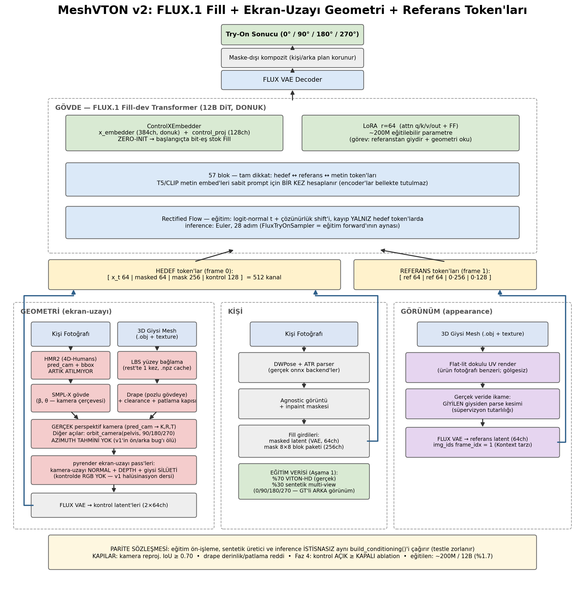

# MeshVTON v2

Virtual try-on built on FLUX.1 Fill, conditioned on screen-space geometry and supervised
with synthetic multi-view data.



> The diagram is generated from the code: `python v2/docs/draw_architecture.py`

v2 replaces v1 (IDM-VTON/SDXL); see the plan file for the design rationale and the phases.
**v2 never imports from v1's `src/`** (the dependency versions are incompatible — separate
environment, separate runtime).

## Rules (v1 lessons)

1. **Parity:** conditioning is produced ONLY by
   `meshvton2/conditioning/builder.py::build_conditioning` — training preprocessing, the
   synthetic generator and inference all call the same function. `tests/test_parity.py`
   enforces it.
2. **One resolution:** 768×1024 (`configs/base.yaml`). No other resolution.
3. **No RGB in the control:** the geometry channels are normal + depth + silhouette. Appearance
   comes only from the textured reference (the grey-render hallucination lesson).
4. **No metric lies:** a metric that cannot be computed returns `None`/"n/a", never 0.0.
5. **No logic in the notebook:** `notebooks/MeshVTON2.ipynb` is a three-cell shell.

## Status

- [x] Phase 0 — eval harness + golden set infrastructure + parity contract (builder stub)
- [~] Phase 1 — zero-shot baseline: the code is ready (`fill_spatial` + `kontext` variants),
      waiting on a Colab run → `notebooks/MeshVTON2.ipynb`. Note: the third variant
      (untrained ref-token) was deferred to Phase 4 — the rationale is in the
      `model/flux_tryon.py` docstring.
- [~] Phase 2 — geometry pipeline: the code is complete (pred_cam camera, LBS drape,
      screen-space render, the real builder — all pyrender, no pytorch3d needed); waiting on
      Colab validation (reprojection IoU ≥ 0.70 + drape QA sheet)
- [~] Phase 3 — synthetic multi-view data: the generator is ready
      (`scripts/generate_synthetic.py`, the directory contract is tested); waiting on a small
      batch + QA on Colab
- [ ] Phase 4 — Stage-1 training (single view: LoRA + zero-init control columns)
- [ ] Phase 5 — Stage-2 training (multi-view consistency)
- [ ] Phase 6 — Blender data v2 + inference hardening

## Quick start

```bash
pip install -r v2/requirements.txt
python -m pytest v2/tests -q                       # contract + metric tests
python v2/scripts/eval.py --self-check <img_dir>   # harness sanity check
# Once the data is ready (Colab):
python v2/scripts/build_golden_set.py --vitonhd-test <test/image> --garments <garments_3d>
python v2/scripts/eval.py --pred-dir <predictions>
```
